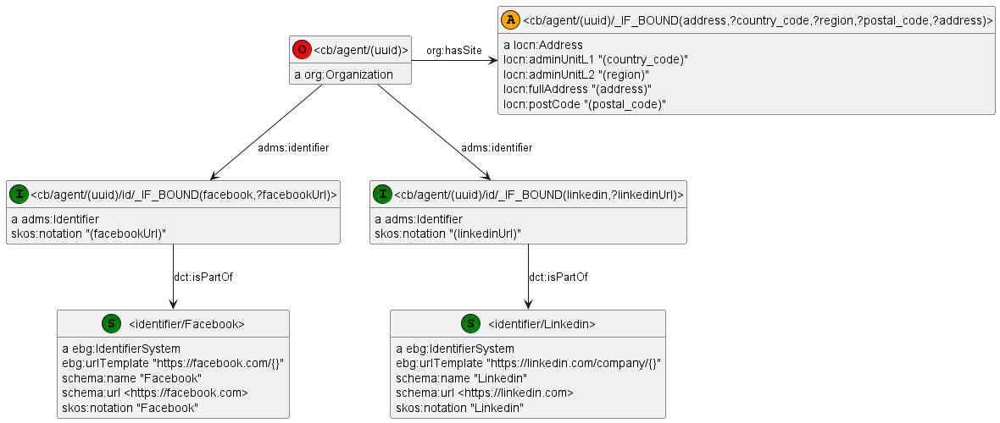

<!-- markdown-toc start - Don't edit this section. Run M-x markdown-toc-refresh-toc -->
**Table of Contents**

- [SYNOPSIS](#synopsis)
- [DESCRIPTION](#description)
    - [Options](#options)
    - [Screenshot](#screenshot)
    - [Prerequisites](#prerequisites)
    - [Process](#process)
    - [RDF Model Examples](#rdf-model-examples)
        - [RDF Model: Crunchbase Organizations](#rdf-model-crunchbase-organizations)
        - [RDF Model: Customers](#rdf-model-customers)
        - [RDF Model: Annual Revenue by Permalink](#rdf-model-annual-revenue-by-permalink)
        - [RDF Model: Grant Spending Categories](#rdf-model-grant-spending-categories)
        - [Per-model Filtering](#per-model-filtering)
        - [Global Filtering](#global-filtering)
        - [Conditional Nodes](#conditional-nodes)
        - [Multiple Variable Interpolation in Literals](#multiple-variable-interpolation-in-literals)
        - [Interpolate A Variable in Prefixed URL](#interpolate-a-variable-in-prefixed-url)
        - [RDF Model Concatenation](#rdf-model-concatenation)
    - [Preprocessor Macros](#preprocessor-macros)
        - [Macro Best Practices](#macro-best-practices)
    - [Generated SPARQL](#generated-sparql)
        - [Insert Patterns: Crunchbase Organizations](#insert-patterns-crunchbase-organizations)
        - [Generated Pre-Binds](#generated-pre-binds)
        - [Generated Binds: Customers](#generated-binds-customers)
        - [Generated Update: Annual Revenue by Permalink](#generated-update-annual-revenue-by-permalink)
        - [Generated Binds: Spending Categories](#generated-binds-spending-categories)
- [SEE ALSO](#see-also)

<!-- markdown-toc end -->

# SYNOPSIS

    perl rdf2sparql.pl             [-e endpoint] model.ttl | cat common.h prefixes.rq - | cpp -P -C -nostdinc - > model-ontorefine.ru
    perl rdf2sparql.pl --construct [-e endpoint] model.ttl | cat common.h prefixes.rq - | cpp -P -C -nostdinc - > model-ontorefine.rq
    perl rdf2sparql.pl --tarql                   model.ttl | cat common.h prefixes.rq - | cpp -P -C -nostdinc - > model.tarql

    Options:
      --construct: generate CONSTRUCT query (default is UPDATE; applies only for Ontotext Refine)
      --tarql:     generate for TARQL (default is Ontotext Refine)
      --endpoint:  OntoRefine endpoint, default "rdf-mapper:ontorefine:PROJECT_ID" (requires rewriting the SPARQL script)

# DESCRIPTION

**rdf2sparql** converts an RDF example with embedded CSV/TSV column names into a SPARQL query for:

- [TARQL](https://tarql.github.io/), which is a is a high-speed streaming convertor. It's a SPARQL processor for tabular data, where each column `col` of each row is exposed as a variable binding `?col` (punctuation is replaced with underscores). See [releases](https://github.com/tarql/tarql/releases), tested with version 1.2-SNAPSHOT, BUILD_DATE: 2017-12-07T13:33:10Z
- [Ontotext Refine](https://graphdb.ontotext.com/documentation/standard/loading-data-using-ontorefine.html), which is an adaptation of OpenRefine for working with RDF data. It exposes a table as a virtual SPARQL endpoint (special service), where each column `col` of each row is exposed as a variable binding `?c_col`.

We've used TARQL to convert large files (over 10M rows, 145 columns) using complex TARQL queries (480 lines: 110 prefixes, 33 nodes, 250 triples, 110 binds).

We've used Ontotext Refine for large and complex CSV files,
e.g. Crunchbase consisting of 18 tables, total 10.5M rows, 318 columns;
for both initial loading and data updates.
See [Crunchbase Challenge](https://gist.github.com/VladimirAlexiev/d5d67feb002dbcfa6b3d4c3dd59b52da) and section "Global Filtering" for details.
(Please note that we use named graph per **table row**, not per **table**.)

## Options

The default is to generate a SPARQL UPDATE query for Ontotext Refine.
It encloses Ontotext Refine variables in a `service` clause that accesses the Ontotext Refine virtual SPARQL endpoint
(see option `--endpoint` later):

    service <rdf-mapper:ontorefine:PROJECT_ID> {
      ...
    }

This has several benefits:

- It ingests directly to GraphDB (without producing an intermediate RDF file), which is faster.
- It overwrites a named graph, so it can be used for ingest or update.
  - The first model line must look like this to specify the graph to overwrite (in angle brackets).
  - You can use parenthesized variable name(s) to compute the graph at runtime.
  - An example from Crunchbase: both `organizations.csv` and `organization_descriptions.csv` contribute triples to the same node `<cb/agent/(uuid)>`.
    However, their respective models specify different named graphs, so that rows from the respective tables can be updated independently.

```
# GRAPH <constant_graph>
# GRAPH <graph/organizations/(uuid)>
# GRAPH <graph/organization_descriptions/(uuid)>
```

- You can match real triples in GraphDB, which can be used to resolve entities ("strings" to "things"). A macro name that ends in "URL" (case-insensitively), e.g. `CB_AGENT_URL(permalink)`, causes the respective patterns to be interpreted outside of the Ontotext Refine virtual service.
- You can split several multi-valued columns (using the `SPLIT` macro) to produce multiple bindings, without fear of Cartesian Product (i.e. their values will not be combined with each other).

Option `--construct` generates a SPARQL CONSTRUCT query.
You can still match GraphDB triples and use multiple multi-valued columns.
Any `GRAPH` comment is ignored, because CONSTRUCT does not support graphs
(see [SPARQL 1.2 issue 31](https://github.com/w3c/sparql-12/issues/31)).
The query produces intermediate RDF data that must be saved before loading to GraphDB,
then you can use the [SPARQL Graph Store Protocol](https://www.w3.org/TR/sparql11-http-rdf-update/)
to overwrite the respective graph.

Option `--tarql` generates a TARQL CONSTRUCT query.
You should put each multivalued column (together with the primary key column)
in a distinct model to avoid Cartesian Product.
You cannot
match RDF data in a repository (see [TARQL issue 25](https://github.com/tarql/tarql/issues/25)),
use UPDATE (see [TARQL issue 67](https://github.com/tarql/tarql/issues/67)),
nor use graphs (see [TARQL issue 98](https://github.com/tarql/tarql/issues/98)).

Option `--endpoint` specifies the OntoRefine SPARQL endpoint to use.

- For Refine 1.2 (15 February 2023) and later,
  use the "project alias" feature to provide an endpoint
  that designates a specific project (tabular data loaded to Refine), eg
  `http://localhost:7333/repositories/ontorefine:organizations`. Here:
  - `organizations` is the project alias,
  - 7333 is the default `server.port` on which Refine responds (see [Refine Configuration Parameters](https://platform.ontotext.com/ontorefine/install-migrate.html#refine-configuration-parameters))
- For older versions the default endpoint is `rdf-mapper:ontorefine:PROJECT_ID`.
  Capture the project identifier from the [ontorefine-cli create command](https://platform.ontotext.com/ontorefine/ontorefine-cli.html#create)
  and rewrite the SPARQL script to put the actual endpoint to use.
  - For versions 1.0 and 1.1, use eg
    `http://localhost:7333/repositories/ontorefine:12345678`
    - Where `12345678` is the captured project identifier.
  - For versions older than 1.0 that were embedded in GraphDB, use eg
    `rdf-mapper:ontorefine:12345678`.
    - Where `12345678` is the captured project identifier.

You can abbreviate options. All these are equivalent:

    -c --co --construct
    -t --ta --tarql
    -e --end --endpoint

## Screenshot
To illustrate the benefits of the tool, here is an illustration:
declarative model (left) vs generated SPARQL Update for Ontorefine (right two).
This is from [test/graphs-crunchbase](../test/graphs-crunchbase):


## Prerequisites

- Ontotext Refine or TARQL as described above
- Perl. Tested with 5.32.1 (Straberry Perl on Cygwin)
- Working CPP preprocessor. Tested with 8.3.0 (x86_64-posix-seh, Built by strawberryperl.com project)
- A file (eg `prefixes.rq`) that defines all common prefixes and is prepended to the generated query
- A file (eg `common.h`) that defines CPP preprocessor macros

## Process

- Make a **rdfpuml** semantic model for a single table, using field names as parenthesized embeds. See below for several examples.
- Run the script followed by the CPP proprocessor as shown above and save the SPARQL script

To process CSV/TSV with the generated SPARQL scripts, use the following steps.

Process with `model.tarql` (variants for CSV or TSV):

    tarql    model.tarql data.csv > data.ttl
    tarql -t model.tarql data.tsv > data.ttl

Process `model-ontorefine.ru` with Ontotext Refine:

- Create a project, load tabular data
- Optionally, perform data cleaning
- Make sure you have a working GraphDB repository to receive the data
- Paste the generated SPARQL into GraphDB workbench
- Optionally, replace the default endpoint to the actual Refine virtual endpoint to be used
- Run the query to update the data in GraphDB

If you save the Ontotext Refine cleaning script (operations JSON),
you can automate the Refine process by using the [ontorefine-cli](https://platform.ontotext.com/ontorefine/ontorefine-cli.html).
We have scripts to automate the following steps:

- Create an Ontotext Refine project and capture its project ID
- Load tabular data into the Ontotext Refine project
- Optionally, apply an OpenRefine data cleaning script
- Optionally, replace the default endpoint in the generated query with the actual endpoint
- Run the query against a GraphDB repository: it will replace the defined named graph(s)
- Delete the Ontotext Refine project

## RDF Model Examples

**rdfpuml** models are RDF Turtle examples that use parenthesized column names
in URLs ("templated URLs") and in attribute values (which can be datatyped).

They are valid Turtle, with the exception that RDF tools issue warnings
about templated literals such as `"(some_date)"^^xsd:date` or `"(amount)"^^xsd:decimal`.

You can also use "functions" that you need to implement as CPP macros.
**rdf2sparql** takes care to unroll the functions into BINDs, adding suffixes to variable names.

See also `test/customer` for a separate example (includes a `Makefile`).

### RDF Model: Crunchbase Organizations

The first example is a simple semantic representation of Crunchbase's `organizations.csv` table:

    # GRAPH <graph/organizations/(uuid)>

    <cb/agent/(uuid)> a cb:Organization;
      cb:uuid '(uuid)';
      cb:name '(name)';
      cb:permalink '(permalink)';
      cb:url '(cb_url)'^^xsd:anyURI;
      cb:rank '(rank)'^^xsd:integer;
      cb:createdAt 'FIXDATE(created_at)'^^xsd:dateTime;
      cb:updatedAt 'FIXDATE(updated_at)'^^xsd:dateTime;
      cb:legalName '(legal_name)';
      cb:organizationRole <cb/organizationRole/URLIFY(SPLIT_COMMA(roles))>;
      cb:domain '(domain)';
      cb:homepageUrl '(homepage_url)'^^xsd:anyURI;
      cb:countryCode '(country_code)';
      cb:stateCode '(state_code)';
      cb:region '(region)';
      cb:city '(city)';
      cb:address '(address)';
      cb:postalCode '(postal_code)';
      cb:status <cb/organizationStatus/URLIFY(status)>;
      cb:shortDescription '(short_description)';
      cb:industry <cb/industry/URLIFY(SPLIT_COMMA(category_list))>;
      cb:numFundingRounds '(num_funding_rounds)'^^xsd:integer;
      cb:totalFundingUsd '(total_funding_usd)'^^xsd:decimal;
      cb:totalFunding '(total_funding)'^^xsd:decimal;
      cb:totalFundingCurrencyCode '(total_funding_currency_code)';
      cb:foundedOn 'FIXDATE(founded_on)'^^xsd:dateTime;
      cb:lastFundingOn 'FIXDATE(last_funding_on)'^^xsd:dateTime;
      cb:closedOn 'FIXDATE(closed_on)'^^xsd:dateTime;
      cb:employeeCount <cb/employeeCount/URLIFY(IFNOTNULL(employee_count))>;
      cb:email '(email)';
      cb:phone '(phone)';
      cb:facebookUrl '(facebook_url)'^^xsd:anyURI;
      cb:linkedinUrl '(linkedin_url)'^^xsd:anyURI;
      cb:twitterUrl '(twitter_url)'^^xsd:anyURI;
      cb:logoUrl '(logo_url)'^^xsd:anyURI;
      cb:alias '(alias1)';
      cb:alias '(alias2)';
      cb:alias '(alias3)';
      cb:primaryRole <cb/organizationRole/URLIFY(primary_role)>;
      cb:numExits '(num_exits)'^^xsd:integer.

It puts all fields in one table and uses macros like
URLIFY to make a phrase usable in URL,
IFNOTNULL to discard parasitic phrases,
SPLIT to split a multi-valued field into multiple bindings, etc.
It uses a GRAPH comment to specify which named graph should be overwritten: it is computed dynamically from the "uuid" field.

### RDF Model: Customers

Next is an example about persons (customers).

    <person/(customer_id)> a :NaturalPerson;
      :id "(customer_id)";
      :firstName "(first_name)";
      :lastName "(last_name)";
      :gender "(gender)";
      :religion "(religion)";
      :hasAddress <person/(customer_id)/address>;
      :hasEvent  <person/(customer_id)/birth>;
      :hasEvent  <person/(customer_id)/education>.

    <person/(customer_id)/address> a :Address;
      :houseNumber "(house_number)";
      :street "(street)";
      :postalCode "(postal_code)";
      :city <country/(country)/city/URLIFY(city)>;
      :country <country/(country)>.

    <country/(country)/city/URLIFY(city)> a :City; :country <country/(country)>; :name "(city)".

    <country/(country)> a :Country; :code "(country)".

    <person/(customer_id)/birth> a :BirthEvent; :hasDate "(date_of_birth)"^^xsd:date.

    <person/(customer_id)/education> a :EducationEvent;
      :hasDate "(enrollment_date)"^^xsd:date;
      :university <university/URLIFY(university)>;
      :degree <degree/URLIFY(education_degree)>.

It dispatches fields to several nodes and uses only one macro (`URLIFY`).

### RDF Model: Annual Revenue by Permalink

Next is a very simple model that adds a field "revenue" to Crunchbase organizations,
based on two columns: "permalink" identifying the company, and "revenue" being a decimal

    # GRAPH <extra/(permalink)/revenue>
    <CB_AGENT_URL(permalink)> ex:annualRevenueUsd "(revenue)"^^xsd:decimal.

The revenue is keyed by "permalink".
But Crunchbase organizations use a different URL (primary key) based on "uuid".
So we use the `CB_AGENT_URL()` macro to lookup by permalink.

### RDF Model: Grant Spending Categories

This model of NIH grants assumes that an application (with primary key `APPLICATION_ID`)
can have multiple spending categories (field `NIH_SPENDING_CATS`) separated by semi-colon.
To avoid Cartesian Product with TARQL, we put this one field in a separate model file:

    <grant/(APPLICATION_ID)> gr:spendingCategory <spendingCategory/URLIFY(SPLIT_SEMI(NIH_SPENDING_CATS))>.

    <spendingCategory/URLIFY(SPLIT_SEMI(NIH_SPENDING_CATS))>
      a skos:Concept ;
      skos:inScheme  <spendingCategory> ;
      skos:prefLabel "SPLIT_SEMI(NIH_SPENDING_CATS)".

    <spendingCategory>
      a skos:ConceptScheme ;
      skos:prefLabel  "NIH spending category".

Note that in addition to making the `gr:spendingCategory` relation, this model also emits extra nodes.
This will lead to redundant triples:
each individual `skos:Concept` is duplicated as many times as it's used in grants,
and `skos:ConceptScheme` is duplicated as the total number of grants.

This does not lead to conflicts since the same triple cannot be recorded multiple times in an RDF repository.
However, if this data redundancy is bothersome, you can
normalize the Concept data to a separate file of unique concepts;
and move the ConceptScheme into a separate "constant" RDF file
that doesn't need to be processed with **rdf2sparql**.

### Per-model Filtering

You can use the field `puml:label` to specify a filter condition to be applied for each row of a table (model).
For example, let's say we have a table of some content (web pages)
that needs to be published as RDF only when the field `status` is "published".
Use the following model:

    <(url)> a s:WebPage;
      puml:label "filter(?status='published')"; ## RDFize only "published" pages
      s:name     "(title)";
      s:author   "(author)";
      s:date     "(date)"^^xsd:date.

`puml:label` is printed out in red, and its contents are added at the end of the query.
For Ontotext Refine, this will look like:

    delete ...
    insert ...
    where {
      service <rdf-mapper:ontorefine:PROJECT_ID> {
        ...
        filter(?status='published')
      }
    }

For TARQL, this will look like:

    construct ...
    where {
      ...
      filter(?status='published')
    }

See the folder `test/filter-content` for a complete test case using TARQL.
There are 3 rows in `content.csv` but the first one doesn't have `status='published'`,
so it's omitted from `content-result.ttl`.

Notes:

- Don't forget to write out `filter(...)` and use question marks to identify the variables (fields).
- Since the model Turtle is not really parsed, you should write the `puml:label` on one line, trailed by semicolon or dot (and optional trailing whitespace and comment).
- You can use triple quotes or apostrophes to surround the content.
- The same field is used in `rdf2rml` with a completely different meaning: as a SQL table or query. I know, this is an ugly hack.

### Global Filtering

In addition to per-model filtering (see previous section), you can also use global filtering specified with command-line options.
The best use of this feature is to generate transformation scripts that handle both initial loading and data updates,
assuming that the tabular source data has update timestamps: see `test/graphs-crunchbase` for details.

- Each Crunchbase table includes an `updated_at` timestamp in every row
- We initialize a global timestamp using the query `updatedAt_seed.ru`.
  We record it in the database as a single triple with value in proper `xsd:dateTime` format:

```ttl
<cb> cb:updatedAt '0001-01-01T00:00:00'^^xsd:dateTime
```

- We compare the timestamp of each row to the global timestamp like this (see `Makefile`):
  - We specify `--filterColumn` so that `rdf2sparql.pl` can generate the OntoRefine-specific pre-bind
  - After fetching the global timestamp, the `--filter` condition converts it to a form compatible with `?updated_at`
    by replacing 'T' (date-time separator according to `xsd:dateTime` format) to space.
    We could have chosen to store the global timestamp with a space:
    then we wouldn't need this conversion, but would have to give up the `xsd:dateTime` datatype.
  - The filter is added outside of the OntoRefine `service` because the global timestamp is in the RDF database, not OntoRefine tabular data
  - The filter eliminates rows that have not been updated later than the global timestamp
```
perl -S rdf2sparql.pl \
  --filterColumn updated_at \
  --filter "<cb> cb:updatedAt ?UPDATED_AT_DT bind(replace(str(?UPDATED_AT_DT),'T',' ') as ?UPDATED_AT) filter(?updated_at > ?UPDATED_AT)" \
```

- After the per-table updates, we run `updatedAt_bump.ru`, which bumps the timestamp to the greatest update timestamp of all rows in all tables:

```sparql
delete where {<cb> cb:updatedAt ?old};
insert {<cb> cb:updatedAt ?new}
where {select (max(?upd) as ?new) {[] cb:updatedAt ?upd}};
```

- You may want to use a standard predicate like `dct:modified` for the timestamp, instead of the custom predicate `cb:updatedAt`.

### Conditional Nodes

Consider the following more advanced model, which maps Crunchbase data to the
[euBusinessGraph model](https://github.com/euBusinessGraph/eubg-data/tree/master/model) (see [google doc](https://docs.google.com/document/d/1dhMOTlIOC6dOK_jksJRX0CB-GIRoiYY6fWtCnZArUhU/edit)),
which itself uses W3C Org, ADMS, Schema.org, etc.



See the `test/conditional-node`
in particular the model ``test/conditional-node/organizations.ttl`
and the key parts:

    <cb/agent/(uuid)> a org:Organization;
      org:hasSite <cb/agent/(uuid)/_IF_BOUND(address,country_code,region,postal_code,street)>;
      adms:identifier
        <cb/agent/(uuid)/id/_IF_BOUND(facebook,facebookUrl)>,
        <cb/agent/(uuid)/id/_IF_BOUND(linkedin,linkedinUrl)> .
    <cb/agent/(uuid)/_IF_BOUND(address,country_code,region,postal_code,street)> a locn:Address;
      ...
    <cb/agent/(uuid)/id/_IF_BOUND(facebook,facebookUrl)> a adms:Identifier;
      ...
    <cb/agent/(uuid)/id/_IF_BOUND(linkedin,linkedinUrl)> a adms:Identifier;

We emit some of the fields in structured nodes.
But we want to create these nodes only if the fields are bound,
i.e. we don't want to create parasitic "empty" nodes with no business payload.
For this we create the `_IF_BOUND(...)` macro, see `common.h`.
It uses techniques from this [StackOverflow answer](https://stackoverflow.com/a/65997567/20282178)
about iteration over `__VA_ARGS_` variadic extra arguments (in this case, limited to 5).

    #define __IF_BOUND_1(x,y1)             bind(if(bound(?y1),#x,?UNDEF) as ?x##_IF_BOUND)
    #define __IF_BOUND_2(x,y1,y2)          bind(if(bound(?y1)||bound(?y2),#x,?UNDEF) as ?x##_IF_BOUND)
    #define __IF_BOUND_3(x,y1,y2,y3)       bind(if(bound(?y1)||bound(?y2)||bound(?y3),#x,?UNDEF) as ?x##_IF_BOUND)
    #define __IF_BOUND_4(x,y1,y2,y3,y4)    bind(if(bound(?y1)||bound(?y2)||bound(?y3)||bound(?y4),#x,?UNDEF) as ?x##_IF_BOUND)
    #define __IF_BOUND_5(x,y1,y2,y3,y4,y5) bind(if(bound(?y1)||bound(?y2)||bound(?y3)||bound(?y4)||bound(?y5),#x,?UNDEF) as ?x##_IF_BOUND)

    #define __IF_BOUND_PICK_N(_1,_2,_3,_4,_5,N,...) __IF_BOUND_##N
    #define _IF_BOUND(x,...) __IF_BOUND_PICK_N(__VA_ARGS__,5,4,3,2,1)(x,__VA_ARGS__)

Several things are going on here:

- First we define 5 macros that handle the cases of 1..5 extra arguments.
- They use a disjunction of `bound()` to check if any of the extra arguments are bound.
- If so, the "stringify" macro operator `#` returns the "string representation" of the first argument.
- Otherwise, the `?UNDEF` variable is returned, which by convention is never bound.
- Be careful about the output variable: we need to write out the question mark before it (since the same name `x` is also used in its stringified form), and we follow it by one underscore `_` even though the macro name itself starts with underscore.
- The macro `__IF_BOUND_PICK_N` uses the `##` token concatenation operator to pick one of the 5 macros.
- The final macro `_IF_BOUND` calls `__IF_BOUND_PICK_N` with a carefully crafted tail sequence `5,4,3,2,1`. Eg if `__VA_ARGS__` has 4 elements, they will be eaten up by the argumentss `_1,_2,_3,_4`. The constant `5` will be eaten by the argument `_5`, so the argument `N` will be bound to the next constant `4`, so the macro `__IF_BOUND_4` will be picked.
- After the correct macro is picked, all arguments `(x,__VA_ARGS__)` are passed to it. So you see that in the implementation of `_IF_BOUND`, `__VA_ARGS__` is used twice: first to pick the correct numbered macro, then to provide it with arguments.

When `rdf2sparql` sees a macro name starting with underscore `_`, it leaves its arguments alone (doesn't add a question mark before the first argument), and doesn't prepend an extra underscore before the macro name.

This results in the following binds in the `where` clause:

    bind(if(bound(?country_code)||bound(?region)||bound(?postal_code)||bound(?street),"address",?UNDEF) as ?address_IF_BOUND)
    bind(iri(concat("cb/agent/",?uuid,"/",?address_IF_BOUND)) as ?cb_agent_uuid_address_IF_BOUND_URL)
    bind(if(bound(?facebookUrl),"facebook",?UNDEF) as ?facebook_IF_BOUND)
    bind(iri(concat("cb/agent/",?uuid,"/id/",?facebook_IF_BOUND)) as ?cb_agent_uuid_id_facebook_IF_BOUND_URL)
    bind(if(bound(?linkedinUrl),"linkedin",?UNDEF) as ?linkedin_IF_BOUND)
    bind(iri(concat("cb/agent/",?uuid,"/id/",?linkedin_IF_BOUND)) as ?cb_agent_uuid_id_linkedin_IF_BOUND_URL)

To explain the first two lines:
first we check if any of the "business payload" fields are bound, and return the string "address" or UNDEF.
Then we concat this string with some constant and variabel parts to form a URL.
If the string is unbound, then the URL will be unbound.
Then any triple using the unbound URL will **not** be emitted, avoiding the creation of a parasitic node.

### Multiple Variable Interpolation in Literals

Above you've seen many examples where a single column is used as the value of a literal (with optional datatype attached).
Now it is also possible to use several variables, and to intersperse fixed text with variables, eg:
```ttl
<tag/refinery-compressor/URLIFY(tag)> a skos:Concept, sosa:FeatureOfInterest;
  skos:inScheme <tag>;
  skos:prefLabel "(tag)";                        ## only a variable
  skos:description "Refinery compressor (tag)".  ## new: fixed text interspersed with variable
```

### Interpolate A Variable in Prefixed URL

Above you've seen many examples of templated URLs that use fixed and variable parts.
Now you can also use a variable with prefixed URLs.

Consider this example of describing Refinery sensor data columns:
```ttl
@prefix unit: <http://qudt.org/vocab/unit/(unit)>.
@prefix qk:   <http://qudt.org/schema/quantityKind/(quantityKind)>.

<schema/refinery/(n)> a csvw:Column, sosa:ObservableProperty;
  sosa:hasFeatureOfInterest <feature/URLIFY(SPLIT(features))>;
  un:qualifier              <qualifier/SPLIT(statisticalQualifiers)>;
  qudt:hasQuantityKind      qk:\(quantityKind\);  ## new
  qudt:hasUnit              unit:\(unit\).        ## new
```
- The first 3 lines use relative templated URLs
- The next 2 lines (marked `new`) use prefixed URLs with a variable.
  - Parentheses need to be escaped in a prefixed URL (but they display without backslashes in `rdfpuml`)
  - We could have written them as as follows, but it's better not to use full URLs, in order to avoid mistakes:
```ttl
  qudt:hasQuantityKind <http://qudt.org/vocab/unit/(unit)>;
  qudt:hasUnit         <http://qudt.org/schema/quantityKind/(quantityKind)>.
```


### RDF Model Concatenation

**rdf2sparql** works on a single CSV table at a time (**rdf2rml** does not have this limitation).
Furthermore, as seen above, you may need to split a model
into "component" sub-models to handle multi-valued columns.
Making diagrams from such tiny models is not very useful.

Luckily, concatenating several Turtle files is also a valid Turtle.
So you can make an overall model by concatenating the component models.

Here is a Makefile from a recent project.
It specifies how to make the overall `nih-model.ttl`, and then the diagram `nih-model.png` from it.

    all: nih-model.ttl nih-model.png prefixes.rq

    nih-model.ttl: prefixes.ttl nih-activityType.ttl nih-applicationType.ttl nih-department.ttl \
      nih-funder.ttl nih-funding.ttl nih-fundingMechanism.ttl nih-grant.ttl nih-linkClinicalStudy.ttl \
      nih-linkPatent.ttl nih-linkPublication.ttl nih-principalInvestigator.ttl nih-researcher.ttl \
      nih-spendingCategory.ttl nih-studySection.ttl puml.ttl
            cat $^ | perl nih-model-rename.pl > $@

    %.png: %.ttl
            rdfpuml.bat $*.ttl
            puml.bat $*.puml
            rm $*.puml

    prefixes.rq: prefixes.ttl
            perl -pe 'm{###} and last; s{^@}{}; s{ *\.$$}{}' $^ > $@

It uses a shared `prefixes.ttl` and its SPARQL variant `prefixes.rq`
that is prepended to any generated query.
To ensure connectivity of the overall model, a script like `nih-model-rename.pl` renames
URLs in object position ("foreign keys")
to respective URLs in subject position ("primary keys"), e.g.:

    #!perl -p

    s{\Q/FIND_CONTACT(PI_IDS)}{/(PI_ID)};
    s{\Q/OMIT_CONTACT(PI_IDS)}{/(PI_ID)};
    s{\Q/FUNDER(FUNDING_ICs)}{/(FUNDING_IC)};

## Preprocessor Macros

In addition to plain CSV field names you can also use macros ("function calls")
that are unrolled by the script into a series of binds using suffixed variable names.
Below are some examples we've used in various projects.
These are implemented as CPP preprocessor macro definitions (e.g. in file `common.h`):

- make a name usable in URL. Replace punctuations with one underscore; remove leading/trailing punctuation. Support all Unicode alphanumeric chars. Convert alphabetical to lowercase.

        #define URLIFY1(x)      lcase(replace(replace(replace(x, "[^\\p{L}0-9]", "_"), "_+", "_"), "^_|_$", ""))

- same but also generates a bind to x_URLIFY

        #define URLIFY(x)       bind(URLIFY1(x) as x##_URLIFY)

- replace space with "T" in a timestamp to conform to xsd:dateTime format

        #define FIXDATETIME(x)  bind(replace(x,' ','T') as x##_FIXDATETIME)

- convert dates from mm/dd/yyyy to yyyy-mm-dd to conform to xsd:date forma

        #define FIXDATE(x)      bind(replace(x,"(..)/(..)/(....)","$3-$1-$2") as x##_FIXDATE)

- lookup a Crunchbase permalink to find the respective agent (organization or person) URL

        #define CB_AGENT_URL(x) filter(bound(x)) x##_CB_AGENT_URL a x##_TYPE; cb:permalink x filter(x##_TYPE in (cb:Person,cb:Organization))

- filter out parasitic values ("other","not provided","unknown")

        #define IFNOTNULL(x)    bind(if(x in ("other","not provided","unknown"),?UNDEF,x) as x##_IFNOTNULL)

- filter out x values that are equal to ?y. Used to strip self-referential parent: CB category mentioning itself as category_group

        #define IFNOTSAME(x,y)  bind(if(x=y,?UNDEF,x) as x##_IFNOTSAME)

- assign the first bound variable amongst the `...` arguments to variable `x##_COALESCE`

        #define COALESCE(x,...) bind(coalesce(__VA_ARGS__) as x##_COALESCE)

- map "Yes","No" to "true","false" respectively

        #define YESNO(x)        bind(if(x="Yes",true,false) as x##_YESNO)

- split `x` on a given delimiter `y` and produce multiple bindings in variable `z`

        #define SPLIT(x,y,z)    z apf:strSplit (x y).

- split on semicolon (optionally followed by space) and produce multiple bindings.

        #define SPLIT_SEMI(x)   SPLIT(x,"; ?",x##_SPLIT_SEMI)

- split on comma (optionally followed by space) and produce multiple bindings.

        #define SPLIT_COMMA(x)  SPLIT(x,", ?",x##_SPLIT_COMMA)

- find a numeric identifier element marked as " (contact)"

        #define FIND_CONTACT(x) bind(replace(x, ".*?([0-9]+) \\(contact\\).*", "$1") as x##_FIND_CONTACT)

- split on semicolon and return all numeric identifiers except the one marked as " (contact)"

        #define OMIT_CONTACT(x) SPLIT_SEMI(x)  bind(if(regex(x##_SPLIT_SEMI,"^$| \\(contact\\)",?UNDEF,x##_SPLIT_SEMI) as x##_OMIT_CONTACT)

- split on backslash then return the first `:`-delimited part of each pair (funder code)

        #define FUNDER(x)       SPLIT(x,"\\\\",x##_SPLIT_BACKSL) bind(replace(x##_SPLIT_BACKSL,"(.+):(.+)","$1") as x##_FUNDER)

- return the second `:`-delimited part of each pair (amount). Must be used together with `FUNDER(x)` because it uses `x##_SPLIT_BACKSL` without binding it

        #define AMOUNT(x)                                        bind(replace(x##_SPLIT_BACKSL,"(.+):(.+)","$2") as x##_AMOUNT)

- bind variable `?x_IF_BOUND` to the string "x" if any of the extra arguments is bound, else leave it unbound

        #define _IF_BOUND(x,...)  // see definition in section Conditional Nodes

Most of the macros implement binds (computations), but you can also use more specialized constructs.
Notes about unusual constructs:

- `URLIFY1(x)` uses the Unicode character class `\\p{L}` for "Letters"
- `IFNOTNULL(x)` and `IFNOTSAME(x)` use a conditional and the variable `?UNDEF`, which by convention is never bound, so is undefined
- `##` concatenates two preprocessor tokens (a variable name and a constant string) to make a new variable name
- `CB_AGENT_URL(x)`: uses a real RDF lookup (outside of the Ontotext Refine virtual endpoint). Before that guards with `bound(x)` (otherwise an unbound variable will return all agents), then checks for respective `rdf:type`
- `SPLIT(x)`: uses a "magic predicate" (`apf:strSplit` in TARQL or `spif:split` in Ontotext Refine) to split x and produce multiple bindings
- `COALESCE(x,...)` uses `__VA_ARGS__` to take any number of arguments (variadic arguments)
- `SPLIT(x,"\\\\\\\\")` escapes backslash twice: once for a SPARQL string, and a second time for the regular expression taht it represents
- `_IF_BOUND(x,...)` is a complex macro. See its definition in section Conditional Nodes

### Macro Best Practices

To save yourself some trouble, here are some hints for writing and using macros:

- Write builtin SPARQL functions in lowercase to avoid mistaking them for macro definitions
- To implement `SPLIT`, use `apf:strSplit` in TARQL and `spif:split` in Ontotext Refine. (In a future version, this tool may take care of that difference.)
- `SPLIT` delimiters often use URL-unfriendly chars. So don't use "raw" SPLIT with 2 arguments, but define "business" versions of SPLIT as above.
- If you want to put comments in models, use double hash `##` since the single hash is interpreted as a preprocessor directive (even if there is a space after it)

## Generated SPARQL

The overall structure of the generated SPARQL query depends on the options you used.
Assume the example in section "RDF Model: Annual Revenue by Permalink", which has 2 special features:

- The graph is computed from data:

        GRAPH <extra/(permalink)/revenue>

- The subject is looked up in the RDF database (see the definition of the respective macro):

        <CB_AGENT_URL(permalink)>
        ->
        filter(bound(?permalink)) ?permalink_CB_AGENT_URL a ?permalink_TYPE; cb:permalink ?permalink filter(?permalink_TYPE in (cb:Person,cb:Organization))

For Ontotext Refine UPDATE:

    delete {graph ?extra_permalink_revenue_URL {?_s_ ?_p_ ?_o_}}
    where {
      service <rdf-mapper:ontorefine:PROJECT_ID> {
        # generated binds
      }
      filter(bound(?permalink)) ?permalink_CB_AGENT_URL a ?permalink_TYPE; cb:permalink ?permalink filter(?permalink_TYPE in (cb:Person,cb:Organization))
      graph ?extra_permalink_revenue_URL {?_s_ ?_p_ ?_o_}};
    insert {graph ?extra_permalink_revenue_URL {
      # insert patterns
    }}
    where {
      service <rdf-mapper:ontorefine:PROJECT_ID> {
        # generated binds
      }
    };

- The graph URL pattern mentioned in the first model line is expanded to a calculated variable `?extra_permalink_revenue_URL`. In this case we use named graph per **table row**; if you use a constant URL then it would be graph per **table**. This way the query can handle both initial data loading and updates.
- The default endpoint `<rdf-mapper:ontorefine:PROJECT_ID>` must be replaced with the actual Refine endpoint before running the query (or specify the `--endpoint` option)
- The script has a special case for macro names matching `*_URL`, that's why the `CB_AGENT_URL` pattern is evaluated outside of the Ontotext Refine virtual endpoint.
- The wildcard pattern `where {... graph ?extra_permalink_revenue_URL {?_s_ ?_p_ ?_o_}}` selects all triples in the graph, to be deleted

For Ontotext Refine CONSTRUCT:

    construct {
      # insert patterns
    }
    where {
      service <rdf-mapper:ontorefine:PROJECT_ID> {
        # generated binds
      }
      filter(bound(?permalink)) ?permalink_CB_AGENT_URL a ?permalink_TYPE; cb:permalink ?permalink filter(?permalink_TYPE in (cb:Person,cb:Organization))
    }

CONSTRUCT doesn't work with named graphs, so any graph is ignored.

For TARQL CONSTRUCT:

    construct {
      # insert patterns
    }
    where {
      # generated binds
    }

TARQL cannot make a lookup in existing RDF data, so macro names matching `*_URL` are not allowed.

### Insert Patterns: Crunchbase Organizations

The script unrolls macro (function) calls into binds, adding uppercase suffixes to the variable names.
In addition, it knows how to process templatized URLs (see var names with a `_URL` suffix)
and how to process datatype attachments (adding the datatype as suffix).
Compare the patterns below to the first model example:

    ?cb_agent_uuid_URL a cb:Organization;
      cb:uuid ?uuid;
      cb:name ?name;
      cb:permalink ?permalink;
      cb:url ?CB_URL;
      cb:rank ?RANK;
      cb:createdAt ?created_at_FIXDATETIME_xsd_dateTime;
      cb:updatedAt ?updated_at_FIXDATETIME_xsd_dateTime;
      cb:legalName ?legal_name;
      cb:organizationRole ?cb_organizationRole_roles_SPLIT_URLIFY_URL;
      cb:domain ?domain;
      cb:homepageUrl ?homepage_url_xsd_anyURI;
      cb:countryCode ?country_code;
      cb:stateCode ?state_code;
      cb:region ?region;
      cb:city ?city;
      cb:address ?address;
      cb:postalCode ?postal_code;
      cb:status ?cb_organizationStatus_status_URLIFY_URL;
      cb:shortDescription ?short_description;
      cb:industry ?cb_industry_category_list_SPLIT1_URLIFY_URL;
      cb:numFundingRounds ?num_funding_rounds_xsd_integer;
      cb:totalFundingUsd ?total_funding_usd_xsd_decimal;
      cb:totalFunding ?total_funding_xsd_decimal;
      cb:totalFundingCurrencyCode ?total_funding_currency_code;
      cb:foundedOn ?founded_on_FIXDATE_xsd_date;
      cb:lastFundingOn ?last_funding_on_FIXDATE_xsd_date;
      cb:closedOn ?closed_on_FIXDATE_xsd_date;
      cb:employeeCount ?cb_employeeCount_employee_count_IFNOTNULL_URLIFY_URL;
      cb:email ?email;
      cb:phone ?phone;
      cb:facebookUrl ?facebook_url_xsd_anyURI;
      cb:linkedinUrl ?linkedin_url_xsd_anyURI;
      cb:twitterUrl ?twitter_url_xsd_anyURI;
      cb:logoUrl ?logo_url_xsd_anyURI;
      cb:alias ?alias1;
      cb:alias ?alias2;
      cb:alias ?alias3;
      cb:primaryRole ?cb_organizationRole_primary_role_URLIFY_URL;
      cb:numExits ?num_exits_xsd_integer.

### Generated Pre-Binds

The script emits a bunch of bindings.

For Ontotext Refine, first come silly "aliases" for each variable used in the model
because of some peculiarities of the Ontotext Refine virtual endpoint
(issue [GDB-6600](https://ontotext.atlassian.net/browse/GDB-6600)):

```
    bind(?c_uuid as ?uuid)
    bind(?c_name as ?name)
    bind(?c_permalink as ?permalink)
    bind(?c_cb_url as ?cb_url)
    bind(?c_rank as ?rank)
    bind(?c_created_at as ?created_at)
    bind(?c_updated_at as ?updated_at)
    bind(?c_legal_name as ?legal_name)
    bind(?c_roles as ?roles)
    bind(?c_domain as ?domain)
    bind(?c_homepage_url as ?homepage_url)
    bind(?c_country_code as ?country_code)
    bind(?c_state_code as ?state_code)
    bind(?c_region as ?region)
    bind(?c_city as ?city)
    bind(?c_address as ?address)
    bind(?c_postal_code as ?postal_code)
    bind(?c_status as ?status)
    bind(?c_short_description as ?short_description)
    bind(?c_category_list as ?category_list)
    bind(?c_num_funding_rounds as ?num_funding_rounds)
    bind(?c_total_funding_usd as ?total_funding_usd)
    bind(?c_total_funding as ?total_funding)
    bind(?c_total_funding_currency_code as ?total_funding_currency_code)
    bind(?c_founded_on as ?founded_on)
    bind(?c_last_funding_on as ?last_funding_on)
    bind(?c_closed_on as ?closed_on)
    bind(?c_employee_count as ?employee_count)
    bind(?c_email as ?email)
    bind(?c_phone as ?phone)
    bind(?c_facebook_url as ?facebook_url)
    bind(?c_linkedin_url as ?linkedin_url)
    bind(?c_twitter_url as ?twitter_url)
    bind(?c_logo_url as ?logo_url)
    bind(?c_alias1 as ?alias1)
    bind(?c_alias2 as ?alias2)
    bind(?c_alias3 as ?alias3)
    bind(?c_primary_role as ?primary_role)
    bind(?c_num_exits as ?num_exits)
```

### Generated Binds: Crunchbase Organizations

Then come a number of bindings generated by:

- Handling templated URLs (eg `?cb_agent_uuid_URL`),
- Unrolling macro (function) calls into binds and suffixed variables (eg `?roles_SPLIT` and then `?roles_SPLIT_URLIFY`)
- Implementing datatype casting using `strdt()` and binding to an uppercased variable name (eg `?CB_URL, ?RANK`)

```
    bind(iri(concat("cb/agent/",?uuid)) as ?cb_agent_uuid_URL)
    bind(strdt(?cb_url,xsd:anyURI) as ?CB_URL)
    bind(strdt(?rank,xsd:integer) as ?RANK)
    bind(replace(?created_at,' ','T') as ?created_at_FIXDATETIME)
    bind(strdt(?created_at_FIXDATETIME,xsd:dateTime) as ?created_at_FIXDATETIME_xsd_dateTime)
    bind(replace(?updated_at,' ','T') as ?updated_at_FIXDATETIME)
    bind(strdt(?updated_at_FIXDATETIME,xsd:dateTime) as ?updated_at_FIXDATETIME_xsd_dateTime)
    ?roles_SPLIT_COMMA spif:split (?roles ',').
    bind(lcase(replace(replace(replace(?roles_SPLIT_COMMA, "[^\\p{L}0-9]", "_"), "_+", "_"), "^_|_$", "")) as ?roles_SPLIT_COMMA_URLIFY)
    bind(iri(concat("cb/organizationRole/",?roles_SPLIT_COMMA_URLIFY)) as ?cb_organizationRole_roles_SPLIT_COMMA_URLIFY_URL)
    bind(strdt(?homepage_url,xsd:anyURI) as ?homepage_url_xsd_anyURI)
    bind(lcase(replace(replace(replace(?status, "[^\\p{L}0-9]", "_"), "_+", "_"), "^_|_$", "")) as ?status_URLIFY)
    bind(iri(concat("cb/organizationStatus/",?status_URLIFY)) as ?cb_organizationStatus_status_URLIFY_URL)
    ?category_list_SPLIT_COMMA spif:split (?category_list ',').
    bind(lcase(replace(replace(replace(?category_list_SPLIT_COMMA, "[^\\p{L}0-9]", "_"), "_+", "_"), "^_|_$", "")) as ?category_list_SPLIT_COMMA_URLIFY)
    bind(iri(concat("cb/industry/",?category_list_SPLIT_COMMA_URLIFY)) as ?cb_industry_category_list_SPLIT_COMMA_URLIFY_URL)
    bind(strdt(?num_funding_rounds,xsd:integer) as ?num_funding_rounds_xsd_integer)
    bind(strdt(?total_funding_usd,xsd:decimal) as ?total_funding_usd_xsd_decimal)
    bind(strdt(?total_funding,xsd:decimal) as ?total_funding_xsd_decimal)
    bind(replace(?founded_on,' ','T') as ?founded_on_FIXDATETIME)
    bind(strdt(?founded_on_FIXDATETIME,xsd:dateTime) as ?founded_on_FIXDATETIME_xsd_dateTime)
    bind(replace(?last_funding_on,' ','T') as ?last_funding_on_FIXDATETIME)
    bind(strdt(?last_funding_on_FIXDATETIME,xsd:dateTime) as ?last_funding_on_FIXDATETIME_xsd_dateTime)
    bind(replace(?closed_on,' ','T') as ?closed_on_FIXDATETIME)
    bind(strdt(?closed_on_FIXDATETIME,xsd:dateTime) as ?closed_on_FIXDATETIME_xsd_dateTime)
    bind(if(?employee_count in ("other","not provided","unknown"),?UNDEF,?employee_count) as ?employee_count_IFNOTNULL)
    bind(lcase(replace(replace(replace(?employee_count_IFNOTNULL, "[^\\p{L}0-9]", "_"), "_+", "_"), "^_|_$", "")) as ?employee_count_IFNOTNULL_URLIFY)
    bind(iri(concat("cb/employeeCount/",?employee_count_IFNOTNULL_URLIFY)) as ?cb_employeeCount_employee_count_IFNOTNULL_URLIFY_URL)
    bind(strdt(?facebook_url,xsd:anyURI) as ?facebook_url_xsd_anyURI)
    bind(strdt(?linkedin_url,xsd:anyURI) as ?linkedin_url_xsd_anyURI)
    bind(strdt(?twitter_url,xsd:anyURI) as ?twitter_url_xsd_anyURI)
    bind(strdt(?logo_url,xsd:anyURI) as ?logo_url_xsd_anyURI)
    bind(lcase(replace(replace(replace(?primary_role, "[^\\p{L}0-9]", "_"), "_+", "_"), "^_|_$", "")) as ?primary_role_URLIFY)
    bind(iri(concat("cb/organizationRole/",?primary_role_URLIFY)) as ?cb_organizationRole_primary_role_URLIFY_URL)
    bind(strdt(?num_exits,xsd:integer) as ?num_exits_xsd_integer)
```

### Generated Binds: Customers

For the Customers example, the binds are pretty similar,
but we use a slightly different definition of `URLIFY` (uses teh Unicode Numeric character class `\\p{N}` instead of `0-9`).

    bind(iri(concat("person/",?customer_id)) as ?person_URL)
    bind(iri(concat("person/",?customer_id,"/address")) as ?person_address_URL)
    bind(iri(concat("person/",?customer_id,"/birth")) as ?person_birth_URL)
    bind(iri(concat("person/",?customer_id,"/education")) as ?person_education_URL)
    bind(replace(replace(replace(?city,'[^\\p{L}\\p{N}]+','_'),'^_',''),'_$','') as ?city_URLIFY)
    bind(iri(concat("country/",?country,"/city/",?city_URLIFY)) as ?country_city_URLIFY_URL)
    bind(iri(concat("country/",?country)) as ?country_URL)
    bind(strdt(?date_of_birth,xsd:date) as ?date_of_birth_xsd_date)
    bind(strdt(?enrollment_date,xsd:date) as ?enrollment_DATE_xsd_date)
    bind(replace(replace(replace(?university,'[^\\p{L}\\p{N}]+','_'),'^_',''),'_$','') as ?university_URLIFY)
    bind(iri(concat("university/",university_URLIFY)) as ?university_URLIFY_URL)
    bind(replace(replace(replace(?education_degree,'[^\\p{L}\\p{N}]+','_'),'^_',''),'_$','') as ?education_degree_URLIFY)
    bind(iri(concat("degree/",?education_degree_URLIFY)) as ?education_degree_URLIFY

### Generated Update: Annual Revenue by Permalink

This model adds some extra Revenue triples into a specified named graph.
The overall Ontotext Refine UPDATE looks like this:

    delete where {graph <extra/revenue> {?x ?p ?o}};
    insert {graph  <extra/revenue> {
      ?permalink_CB_AGENT_URL ex:annualRevenueUsd ?revenue_xsd_decimal
    }}
    where {
      service <rdf-mapper:ontorefine:PROJECT_ID> {
        bind(?c_revenue as ?revenue)
        bind(strdt(?revenue,xsd:decimal) as ?revenue_xsd_decimal)
      }
      filter(bound(?permalink)) ?permalink_CB_AGENT_URL a ?permalink_TYPE; cb:permalink ?permalink filter(?permalink_TYPE in (cb:Person,cb:Organization))
    };

As you can see, the `CB_AGENT_URL` macro is evaluated outside of the Ontotext Refine virtual endpoint.

### Generated Binds: Spending Categories

    bind(iri(concat("grant/",?APPLICATION_ID)) as ?grant_APPLICATION_ID_URL)
    ?NIH_SPENDING_CATS_SPLIT apf:strSplit (?NIH_SPENDING_CATS "; ?").
    bind(replace(replace(replace(?NIH_SPENDING_CATS_SPLIT_SEMI, "[^\\p{L}0-9]", "_"), "_+", "_"), "^_|_$", "") as ?NIH_SPENDING_CATS_SPLIT_SEMI_URLIFY)
    bind(iri(concat("spendingCategory/",?NIH_SPENDING_CATS_SPLIT_SEMI_URLIFY)) as ?spendingCategory_NIH_SPENDING_CATS_SPLIT_SEMI_URLIFY_URL)

# SEE ALSO

- `test/graphs-Crunchbase` for the worked example of generating a SPARQL Update for Crunchbase organizations with dynamic (computed) graph.
- The gist [Crunchbase Semantic Model and Challenge](https://gist.github.com/VladimirAlexiev/d5d67feb002dbcfa6b3d4c3dd59b52da) that publishes all our Crunchbase models.
  It also shows an overall model diagram made by `rdfpuml`
- The issue [Generate Transforms and Shapes from Models](https://github.com/kg-construct/best-practices/issues/7) in the Knowledge Graph Construct W3C community group "Best Practices" github project.
- Generation of Declarative Transformations from Semantic Models,
  Vladimir Alexiev,
  European Data Conference on Reference Data and Semantics (ENDORSE 2023):
  [paper](https://drive.google.com/open?id=1Cq5o9th_P812paqGkDsaEomJyAmnypkD), [presentation](https://docs.google.com/presentation/d/1JCMQEH8Tw_F-ta6haIToXMLYJxQ9LRv6/edit), [video](https://youtu.be/yL5nI_3ccxs)
- **rdfpuml**: a tool that generates PlantUML diagrams from RDF examples.
- **rdf2rml**: a tool that generates R2RML transformations from RDF examples.
