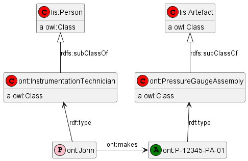
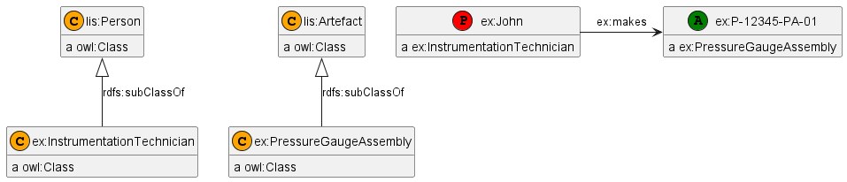

# Complex Types

`rdfpuml` was initially designed to generate instance diagrams, in particular examples that are used as semantic models.
Such diagrams save a lot of space by inlining all types.

However, it has been used lately to generate ontology diagrams or diagrams that mix instances and classes in particular:
- For the [Industrial Data Ontology](https://rds-staging.posccaesar.org/ido/) (IDO) by @johanwk (see this [draft of May 2023](https://rds.posccaesar.org/WD_IDO.pdf)).
- For the Industrial Ontology Foundry (IOF) at [OAGi](https://oagi.org/pages/industrial-ontologies) and [EDMC](https://spec.industrialontologies.org/) by @mhodki and @arsarkar

Related issues:
- https://github.com/VladimirAlexiev/rdf2rml/issues/10 asks to handle blank node (anonymous) types, in particular as they occur in `owl:Restriction` and similar constructs.
- https://github.com/VladimirAlexiev/rdf2rml/issues/14 asks to show classes as separate nodes, and use the `-|>` (`puml:tri`) arrow for `rdfs:subClassOf`.

Before this was implemented, we used a wrong prop name `rdf:type1` instead of `rdf:type` (also called `a`) to see how the diagram will look.
Now such hack is not necessary.

## How to Display a Type as Node

To display a type `x` as a node (rather than inlined), follow this simple convention:

- Add some statements about it (outgoing links), eg
```ttl
x a rdfs:Class.
x a owl:Class.
x rdfs:subClassOf y.
```
- It is not enough to have incoming links (in fact I haven't tried at all how properties would come out on puml diagrams):
```ttl
# NOT ENOUGH
p rdfs:domain x.
q schema:rangeIncludes x.
i rdf:type x.
```
- You can also use `puml:stereotype` to specify what colored circle to add to instances of the class.
  Triples in the `puml:` namespace are not counted as outgoing links.

# Examples

## Instance With Anonymous Type

This comes from the POSC Ceasar Reference Data Library (RDL PCA) as used in ISO 15926.
[PCA_100003953](https://rds.posccaesar.org/ontology/plm/rdl/PCA_100003953/) is "radian per second squared".

[example.ttl](example.ttl):


## Type Defined by Intersection and Restriction

This more complex example comes from the Life Sciences domain.
A type is defined by Intersection and Restriction of other types.

[example2.ttl](example2.ttl):


## IDO Example

This example from the Industrial Data Ontology (IDO) 
shows 2 instances (a Person and an Assembly) with their types and a relation.

[example-technician.ttl](example-technician.ttl):



Before fixing issue 10, the instances showed the types inline, losing the connection to the type nodes:



## IOF Example

[example-iof.ttl](example-iof.ttl):

# Open Issues
- You need to specify the `-|>` arrow for `rdfs:subClassOf`, 
  which is the normal subclass convention in UML:
```ttl
rdfs:subClassOf puml:arrow puml:tri.
```
- I don't do this automatically, since you can also specify a direction and length.
  Eg if you want the arrow to go up and have length 2:
```ttl
rdfs:subClassOf puml:arrow puml:tri-up-2.
```

- [Reification](https://github.com/VladimirAlexiev/rdf2rml/blob/master/doc/rdfpuml.md#reification) has an option `puml:NoReify`. Do we need a similar option `puml:NoInline`?
  Currently I see no need for it, see next item.
- We could use `x a puml:Inline` to declare that a named class should be inlined,
  even though it has outgoing links.
  - However, this is not yet implemented nor tested (it is easy to implement).
  - Let me know if you need it
- I see a bit of clash on `puml:stereotype`:
  - When applied on an instance, the stereotype is used for that node only.
  - When applied on a class, the stereotype is used for all instances of the class.
  - But when you start treating classes as instances as well... Should `ex:InstrumentationTechnician` show `(C)` because it's a class or `(P)` because that's the stereotype for its instances? 
