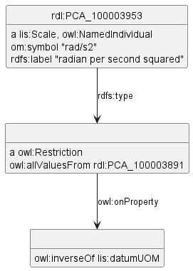
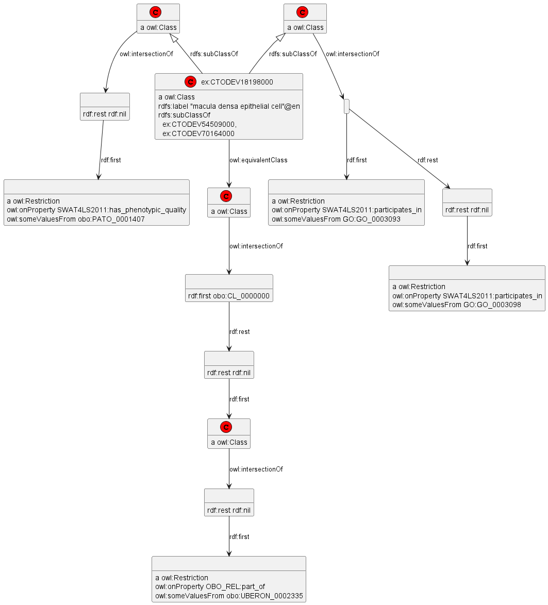

# Blank Node Types

Blank node (anonymous) types occur in `owl:Restriction` and similar constructs.
- These are tests for  https://github.com/VladimirAlexiev/rdf2rml/issues/10
- Before this issue was fixed, we used a wrong prop name `rdf:type1` instead of `rdf:type` (also called `a`) to see how the diagram will look like.

## Instance With Anonymous Type

## Type Defined by Intersection and Restriction

In this lots more complex example, a type is defined by Intersection and Restriction of other types:

