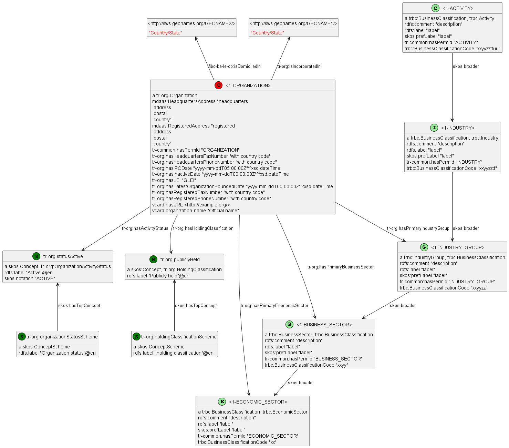
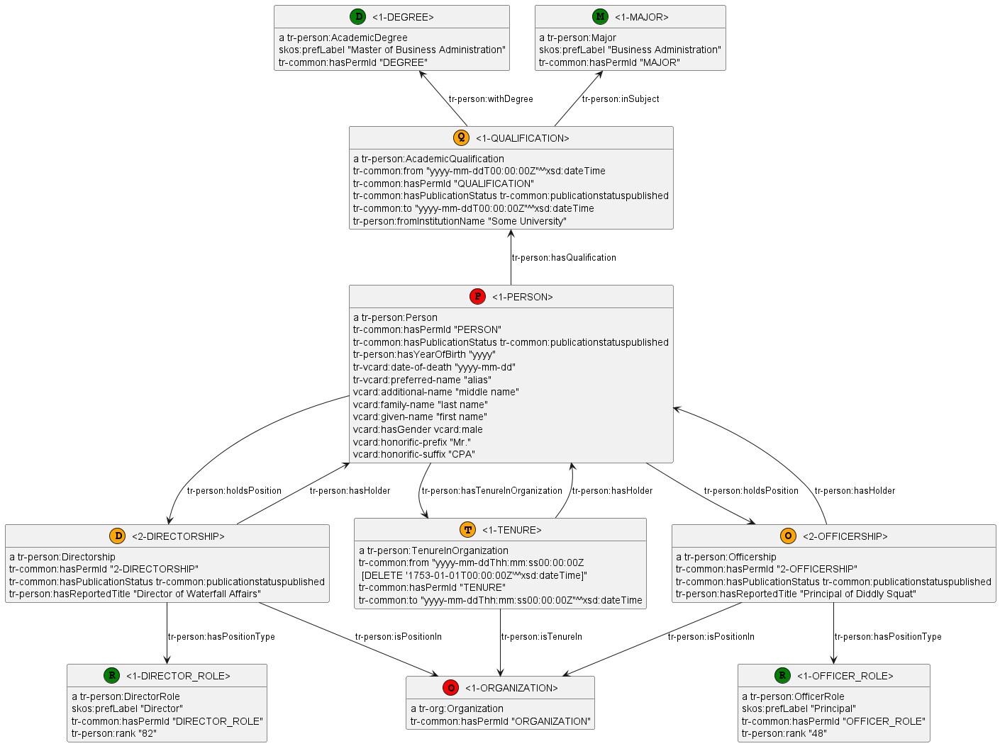
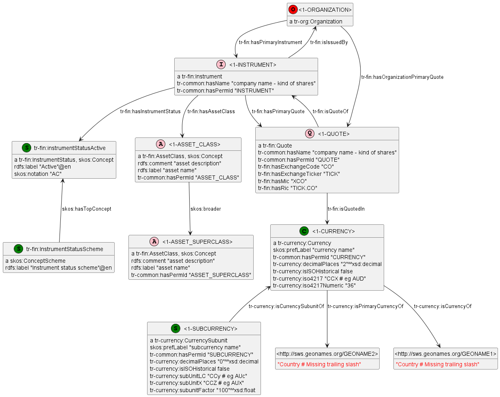
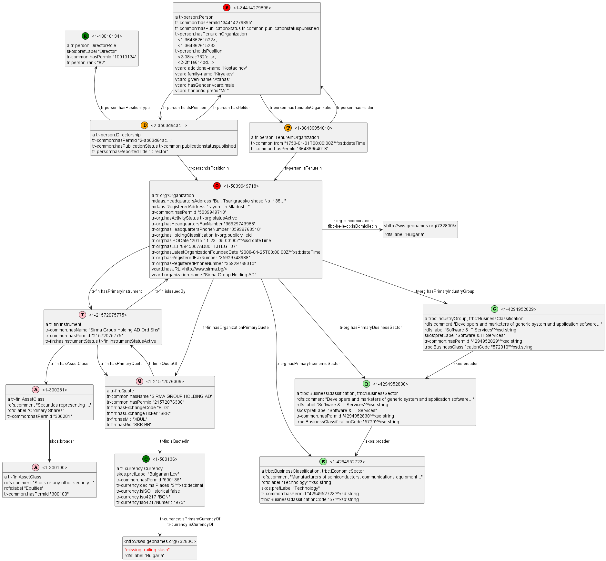
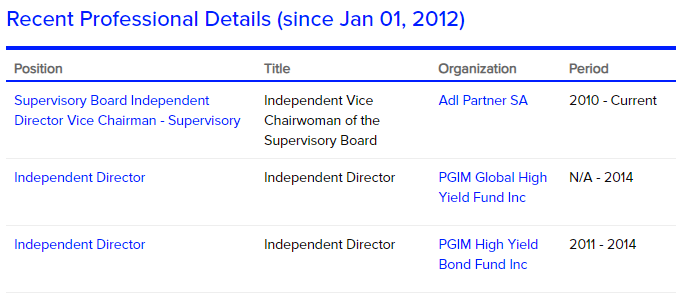

# Refinitiv PermID
<!-- markdown-toc start - Don't edit this section. Run M-x markdown-toc-refresh-toc -->
**Table of Contents**

- [Refinitiv PermID](#refinitiv-permid)
- [Model](#model)
    - [Simplified Model](#simplified-model)
    - [Organization Model](#organization-model)
    - [Person Model](#person-model)
    - [Financial Model](#financial-model)
- [Sample Data](#sample-data)
    - [Atanas Kiryakov, Sirma Group](#atanas-kiryakov-sirma-group)
    - [Robin Smith Positions](#robin-smith-positions)

<!-- markdown-toc end -->

# Model
Refinitiv PermID is a KG of companies, persons, positions and financial instruments.

## Simplified Model
This simplified model is from https://permid.org/:

In the detailed models below, I've replaced specific permid's (which are of the form `1-\d+` or `2-guid`) 
with symbolic names (eg `1-ORGANIZATION`). 
The literal `tr-common:hasPermID` carries the pure permid, without the prefix (eg `ORGANIZATION`).

## Organization Model

Organization, free-text addresses, dates (timezones are included), jurisdiction (incorporated) vs headquarters (domiciled), active/inactive, public or not.
- industry classification (unfortunately the 2 finer-granularity levels are missing)

[permid-model-org.ttl](permid-model-org.ttl), [permid-model-org.png](permid-model-org.png)

## Person Model

Person, academic qualification, positions (director, officer), tenure (unfortunately not related to position).
- Each position has free-text `hasReportedTitle` and lookup `hasPositionType`.

[permid-model-pers.ttl](permid-model-pers.ttl), [permid-model-pers.png](permid-model-pers.png)

## Financial Model
Instrument (with asset class), Quote (with exchange code and ticker), Currency, Subcurrency

[permid-model-fin.ttl](permid-model-fin.ttl), [permid-model-fin.png](permid-model-fin.png)

# Sample Data

## Atanas Kiryakov, Sirma Group

Atanas Kiryakov, Sirma Group, his position in Sirma (Directorship and TenureIn Organization), Sirma's TRBC classification, and its ticker SKK (Quote and Instrument)

[sample-SirmaGroup-AtanasKiryakov.ttl](sample-SirmaGroup-AtanasKiryakov.ttl), [sample-SirmaGroup-AtanasKiryakov.png](sample-SirmaGroup-AtanasKiryakov.png)

## Robin Smith Positions

PermID has two kinds of records that relate Person to Organization:

- A position (`Directorship, Officership`, etc) holds the role (`hasPositionType`)
- `TenureInOrganization`  holds the time interval (`from...to`)
- These are not directly related. 

Look at https://permid.org/1-34415693987 Robin B. Smith.
The PermID website shows 3 positions with dates:

However in RDF, she has 5 `tr-person:holdsPosition` and 10 `tr-person:hasTenureInOrganization`.
This model uses the `left to right direction` option to fit better:

[sample-RobinSmith-positions.ttl](sample-RobinSmith-positions.ttl), [sample-RobinSmith-positions.png](sample-RobinSmith-positions.png)

