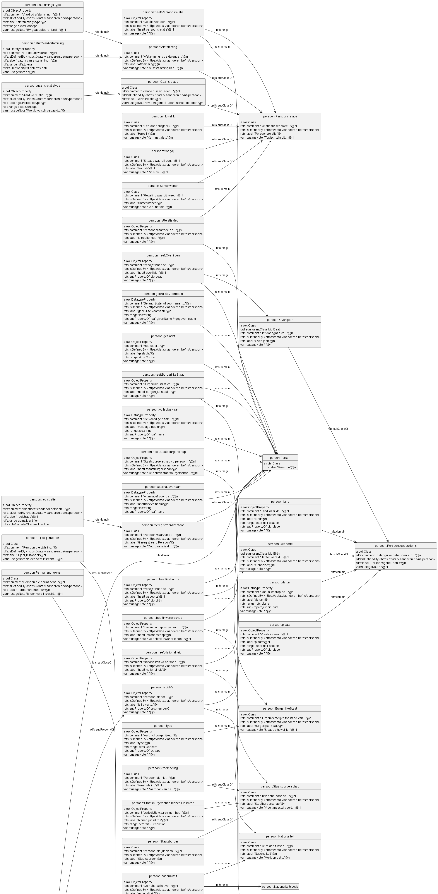
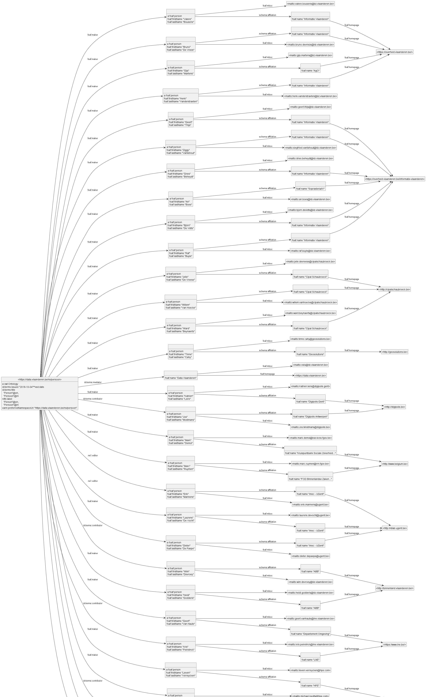

This tries to resolve https://github.com/VladimirAlexiev/rdf2rml/issues/29 ,
which visualizes https://data.vlaanderen.be/ns/persoon.ttl .

General remark: the tool is intended to make instance diagrams 
(and RDF model diagrams of instances that include source `(field)` names in parens).
- It's not intended to make ontology diagrams
- ... although the Industrial Data Ontology (IDO) people use it for that, but do it on smaller pieces to illustrate specific points.
- If you want a general ontology viz tool, try VOWL (and please post a result here so I can include it for comparison)

## Ontology

- Made `prefixes.ttl` from the prefixes in that file
  - Added `persoon: <https://data.vlaanderen.be/ns/persoon#>` : it's silly to define an ontology but no prefix for it!
  - Sorted and aligned prefixes: always a good idea!
  - Added prefixes for external ontologies, eg:

```
adms: <http://www.w3.org/ns/adms#> .
bio: <http://purl.org/vocab/bio/0.1/> .
```

- Added `Makefile` because I hate typing the two commands `rdfpuml` then `puml`
- Shortened `vann:usageNote, rdfs:comment` because these diagrams are supposed to show **structure** not detailed documentation!
  - If you really need long descriptions, break them into newlines yourself (use `"""`)
- Declared  `isDefinedBy` to be an inline property because having all nodes connect to one node doesn't add clarity
- Declared all external props and classes to be inlined because having them as distinct nodes (with no extra info) doesn't add clarity.
  Examples are:

```
    rdfs:range <http://www.w3.org/ns/adms#Identifier> ;
    rdfs:subPropertyOf <http://www.w3.org/ns/adms#Identifier> .
```
- Found some bugs, eg `rdfs:subPropertyOf` above should be `identifier` (lowercase) because it confuses a class and a property

- Added "left to right direction" using `puml:options`



## Contributors

Ontology metadata (including contributors) is a big list of things, so I split it off from the structural diagram.
- Added "left to right direction" using `puml:options`
- Your use of blank nodes for one and the same org `cipalschaubroek.be` contravenes the basic Linked Data principles


